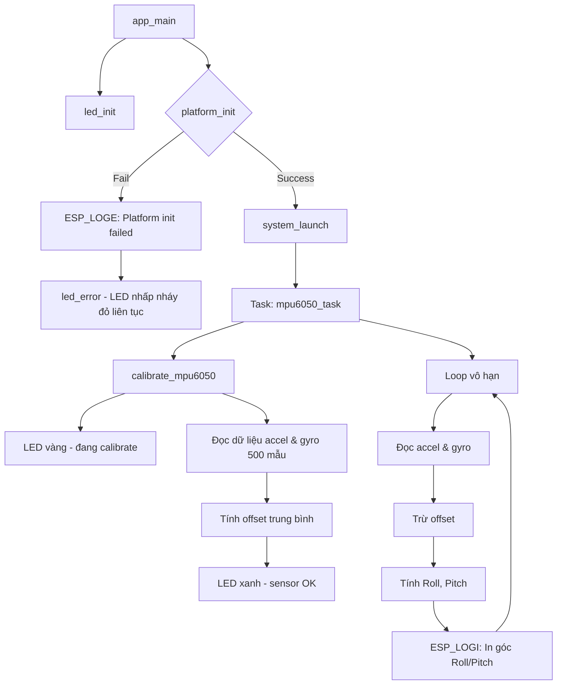

# Example for `mpu6050` driver

## What it does


## Wiring

Connect `SCL` and `SDA` pins to the following pins with appropriate pull-up
resistors.

| Name                                    | Description           | Defaults    |
| --------------------------------------- | --------------------- | ----------- |
| `CONFIG_EXAMPLE_MPU6050_I2C_MASTER_SCL` | GPIO number for `SCL` | `esp32S3` 9 |
| `CONFIG_EXAMPLE_MPU6050_I2C_MASTER_SDA` | GPIO number for `SDA` | `esp32S3` 8 |
| `CONFIG_EXAMPLE_MPU6050_I2C_CLOCK_HZ`   | I2C Clock Freq        | 100000      |


## Logs

```
2026-03-12 16:30:15 I (820101) mpu6050_system: Angle: Roll=0.18 Pitch=-0.31
2026-03-12 16:30:16 I (820201) mpu6050_system: Angle: Roll=-0.31 Pitch=-0.20
2026-03-12 16:30:16 I (820301) mpu6050_system: Angle: Roll=0.12 Pitch=-0.17
2026-03-12 16:30:16 I (820401) mpu6050_system: Angle: Roll=0.07 Pitch=-0.30
2026-03-12 16:30:16 I (820501) mpu6050_system: Angle: Roll=0.14 Pitch=0.11
2026-03-12 16:30:16 I (820601) mpu6050_system: Angle: Roll=0.11 Pitch=0.09
2026-03-12 16:30:16 I (820701) mpu6050_system: Angle: Roll=-0.06 Pitch=-0.07
2026-03-12 16:30:16 I (820801) mpu6050_system: Angle: Roll=0.01 Pitch=0.02
2026-03-12 16:30:16 I (820901) mpu6050_system: Angle: Roll=0.32 Pitch=0.02
2026-03-12 16:30:16 I (821001) mpu6050_system: Angle: Roll=-0.12 Pitch=-0.27
2026-03-12 16:30:16 I (821101) mpu6050_system: Angle: Roll=0.12 Pitch=-0.16
2026-03-12 16:30:17 I (821201) mpu6050_system: Angle: Roll=-0.02 Pitch=0.15
2026-03-12 16:30:17 I (821301) mpu6050_system: Angle: Roll=0.31 Pitch=-0.02
2026-03-12 16:30:17 I (821401) mpu6050_system: Angle: Roll=0.05 Pitch=-0.24
2026-03-12 16:30:17 I (821501) mpu6050_system: Angle: Roll=0.02 Pitch=-0.07
```
